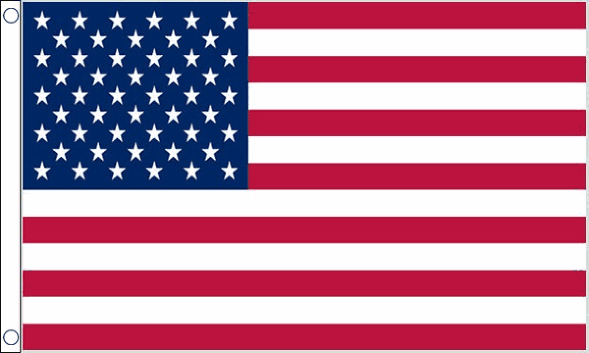

# switch_language
## 1. Add this list on the drop down list 
### (Here we can add language as many as we want)

    <li><a href="#googtrans(en|en)" class="lang-en lang-select" data-lang="en"> USA</a></li>
    <li><a href="#googtrans(en|bn)" class="lang-es lang-select" data-lang="ja"> Bangli</a></li>
    <li><a href="#googtrans(en|de)" class="lang-es lang-select" data-lang="de"> Germany</a></li>
    <li><a href="#googtrans(en|ja)" class="lang-es lang-select" data-lang="ja"> JAPAN</a></li>
  

## 2. Add this style for removing google logo and google top bar 
### (This style can use externaly or internaly)
  .lang-select img{ max-width: 15px;}
  
  .lang-select{ text-decoration: none;}
  
  .translated-ltr{margin-top:-40px;}
  
  .translated-ltr{margin-top:-40px;}
  
  .goog-te-banner-frame {display: none;margin-top:-20px;}
  
  .goog-logo-link { display:none !important;} 

  .goog-te-gadget{ color: transparent !important;}
  
  
  ## 3. add jquery   
    
  
  ## 4. Add this javascript code 
  ### (This javascript code can be used externaly or internaly)
    function googleTranslateElementInit() {
      new google.translate.TranslateElement({pageLanguage: 'en', layout: google.translate.TranslateElement.FloatPosition.TOP_LEFT}, 'google_translate_element');
    }
    function triggerHtmlEvent(element, eventName) {
      var event;
      if (document.createEvent) {
        event = document.createEvent('HTMLEvents');
        event.initEvent(eventName, true, true);
        element.dispatchEvent(event);
      } else {
        event = document.createEventObject();
        event.eventType = eventName;
        element.fireEvent('on' + event.eventType, event);
      }
    }
    jQuery('.lang-select').click(function() {
      var theLang = jQuery(this).attr('data-lang');
      jQuery('.goog-te-combo').val(theLang);

      //alert(jQuery(this).attr('href'));
      window.location = jQuery(this).attr('href');
      location.reload();

    });
    
   ## 5. Add google translate api link
    
